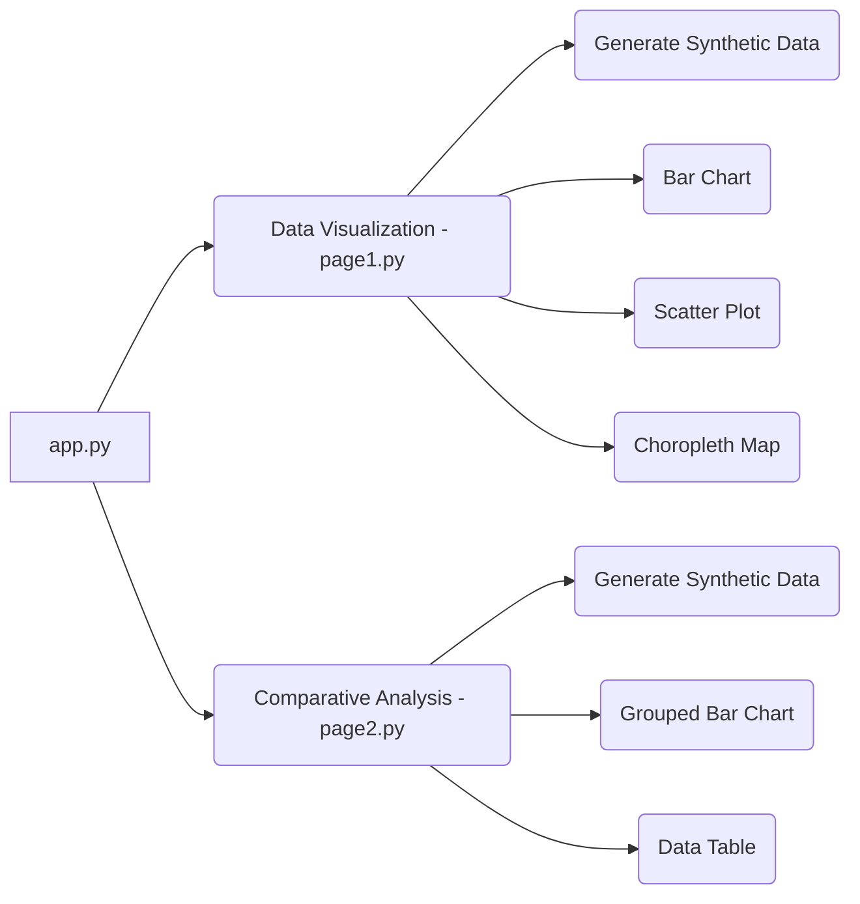

id: 6848578a955009fdec049b6f_documentation
summary: Introduction to Geopolitics Documentation
feedback link: https://docs.google.com/forms/d/e/1FAIpQLSfWkOK-in_bMMoHSZfcIvAeO58PAH9wrDqcxnJABHaxiDqhSA/viewform?usp=sf_link
environments: Web
status: Published
# Geopolitics and Globalization: A Data Visualization and Comparative Analysis Codelab

This codelab guides you through a Streamlit application designed to explore the relationship between geopolitics, globalization, and economic indicators. You will learn how to use interactive visualizations to analyze synthetic data representing various countries and their key metrics related to globalization. This application serves as an educational tool to understand complex geopolitical concepts through data-driven insights.

**Key Highlights:**

*   **Interactive Data Exploration:** Use Streamlit to create dynamic dashboards for visualizing geopolitical data.
*   **Understanding Globalization:** Explore the impacts of globalization on different countries through key metrics.
*   **Comparative Analysis:** Compare countries based on selected metrics to understand their relative performance.

## Setting Up Your Environment
Duration: 00:05

Before you begin, ensure you have Python installed along with the necessary libraries.  You can install the required packages using pip:

```bash
pip install streamlit pandas plotly
```

This command installs Streamlit for creating the application, pandas for data manipulation, and plotly for creating interactive visualizations.

## Understanding the Application Architecture
Duration: 00:10

The application is structured into three main files:

*   `app.py`: This is the main application file that serves as the entry point. It handles the overall layout, navigation, and calls the individual page functionalities.
*   `application_pages/page1.py`: This file contains the code for the "Data Visualization" page, allowing users to explore individual metrics through bar charts, scatter plots, and choropleth maps.
*   `application_pages/page2.py`: This file implements the "Comparative Analysis" page, enabling users to compare multiple countries and metrics using grouped bar charts and a data table.

Here's a simple diagram illustrating the application's architecture:



## Diving into `app.py`: The Main Application
Duration: 00:15

This file sets up the Streamlit application's basic structure, including the title, sidebar, and navigation.

```python
import streamlit as st
import pandas as pd
import plotly.express as px

st.set_page_config(page_title="Introduction to Geopolitics", layout="wide")
st.sidebar.image("https://www.quantuniversity.com/assets/img/logo5.jpg")
st.sidebar.divider()
st.title("Introduction to Geopolitics")
st.divider()

st.markdown("""
In this lab, we will explore the impacts of globalization on various countries using interactive visualizations.
We will use a synthetic dataset to analyze key metrics such as trade volume, foreign investment, cultural exchange, and economic growth.
This will help us understand the complex relationship between globalization and economic performance from a geopolitical perspective.

**Key Concepts:**

-   **Globalization:** The increasing interconnectedness and interdependence of countries through trade, investment, migration, and cultural exchange.
    *Example:* The global supply chain for automobiles.

-   **Geopolitics:** The study of the influence of geography (human and physical) on politics and international relations.
    *Example:* Russia's control over natural gas pipelines and its influence on European countries.

-   **Trade Volume:** The total value of goods and services traded between countries.
    *Formula:* Trade Volume = Total Value of Exports + Total Value of Imports

-   **Foreign Investment:** Investment made to acquire lasting interest in enterprises operating outside of the economy of the investor.
    *Types:* Foreign Direct Investment (FDI) and portfolio investment.

-   **Cultural Exchange:** The reciprocal exchange of ideas, values, beliefs, and traditions between cultures.

-   **Economic Growth:** The increase in the value of goods and services produced by an economy over a period.
    *Formula:* Economic Growth Rate = ((GDP in Current Year - GDP in Previous Year) / GDP in Previous Year) \* 100

-   **State Actors:** Typically national governments, political organizations, or country leaders that exert authority over a country's national security and resources.

-   **Non-State Actors:** Those that participate in global political, economic, or financial affairs but do not directly control national security or country resources.
""")

# Your code starts here
page = st.sidebar.selectbox(label="Navigation", options=["Data Visualization", "Comparative Analysis"])

if page == "Data Visualization":
    from application_pages.page1 import run_page1
    run_page1()
elif page == "Comparative Analysis":
    from application_pages.page2 import run_page2
    run_page2()
# Your code ends

st.divider()
st.write("© 2025 QuantUniversity. All Rights Reserved.")
st.caption("The purpose of this demonstration is solely for educational use and illustration. "
           "Any reproduction of this demonstration "
           "requires prior written consent from QuantUniversity.")
```

**Key Components:**

*   `st.set_page_config()`: Sets the title and layout of the Streamlit application.
*   `st.sidebar`: Creates a sidebar for navigation and user inputs.
*   `st.title()`: Displays the main title of the application.
*   `st.markdown()`: Renders text and Markdown content, including key concept definitions.
*   `st.selectbox()`: Creates a dropdown menu in the sidebar for selecting different pages.
*   Conditional Page Loading: Based on the user's selection, the corresponding page (`page1.py` or `page2.py`) is imported and its `run_page1()` or `run_page2()` function is executed.
*   Copyright and Caption: Displays copyright information and a disclaimer at the bottom of the application.

This structure allows users to navigate between the "Data Visualization" and "Comparative Analysis" sections.

## Exploring `page1.py`: Data Visualization
Duration: 00:25

This page focuses on visualizing individual metrics using bar charts, scatter plots, and a choropleth map.

```python
import streamlit as st
import pandas as pd
import plotly.express as px
import random

def generate_synthetic_data(num_countries=10):
    countries = [f"Country {i+1}" for i in range(num_countries)]
    data = {
        "Country": countries,
        "Trade Volume": [random.randint(100, 1000) for _ in range(num_countries)],
        "Foreign Investment": [random.randint(50, 500) for _ in range(num_countries)],
        "Cultural Exchange": [random.randint(20, 200) for _ in range(num_countries)],
        "Economic Growth": [random.uniform(1.0, 5.0) for _ in range(num_countries)],
    }
    df = pd.DataFrame(data)
    return df

def run_page1():
    st.header("Data Visualization")
    st.markdown("Explore the relationship between different metrics of globalization using interactive visualizations.")

    df = generate_synthetic_data()

    # Sidebar for user inputs
    selected_countries = st.sidebar.multiselect("Select Countries", options=df["Country"].unique(), default=df["Country"].unique())
    metric_to_visualize = st.sidebar.selectbox("Select Metric to Visualize", options=["Trade Volume", "Foreign Investment", "Cultural Exchange", "Economic Growth"])

    # Filter data based on user selections
    filtered_df = df[df["Country"].isin(selected_countries)]

    # Create visualizations
    st.subheader("Bar Chart")
    fig_bar = px.bar(filtered_df, x="Country", y=metric_to_visualize, title=f"{metric_to_visualize} by Country")
    st.plotly_chart(fig_bar, use_container_width=True)

    st.subheader("Scatter Plot")
    # Choose a second metric for the scatter plot
    second_metric = st.sidebar.selectbox("Select Second Metric for Scatter Plot", options=["Trade Volume", "Foreign Investment", "Cultural Exchange", "Economic Growth"], index=1)

    fig_scatter = px.scatter(filtered_df, x=metric_to_visualize, y=second_metric, color="Country",
                             title=f"Correlation between {metric_to_visualize} and {second_metric}")
    st.plotly_chart(fig_scatter, use_container_width=True)

    st.subheader("Choropleth Map")
    # Create a simplified dataset for the choropleth map (using only one metric)
    choropleth_data = {
        "Country": filtered_df["Country"],
        "Value": filtered_df[metric_to_visualize]
    }
    choropleth_df = pd.DataFrame(choropleth_data)
    # Add a column for country codes (ISO Alpha-3)
    country_codes = ['USA', 'CHN', 'JPN', 'DEU', 'GBR', 'FRA', 'ITA', 'CAN', 'KOR', 'AUS']  # Example codes, replace with actual codes
    choropleth_df["iso_alpha"] = country_codes[:len(filtered_df)] # ensures the correct number of country codes
    fig_choropleth = px.choropleth(choropleth_df,
                                    locations="iso_alpha",
                                    color="Value",
                                    hover_name="Country",
                                    color_continuous_scale=px.colors.sequential.Plasma,
                                    title=f"{metric_to_visualize} Distribution")
    st.plotly_chart(fig_choropleth, use_container_width=True)

    st.markdown("The visualizations above display the selected metric for different countries. "
                "Use the sidebar to select countries and metrics for comparison.")

if __name__ == "__main__":
    run_page1()
```

**Key Functionalities:**

*   `generate_synthetic_data()`: Generates a Pandas DataFrame with synthetic data for several countries, including metrics like Trade Volume, Foreign Investment, Cultural Exchange, and Economic Growth.  This allows the application to function without relying on an external dataset.
*   `st.sidebar.multiselect()`: Creates a multiselect widget in the sidebar, allowing users to select specific countries for visualization.
*   `st.sidebar.selectbox()`: Creates a dropdown menu in the sidebar for selecting the metric to visualize.
*   Filtering Data: Filters the DataFrame based on the selected countries.
*   `plotly.express`: Generates interactive visualizations:
    *   Bar Chart: Displays the selected metric for each country as a bar chart.
    *   Scatter Plot: Shows the correlation between two selected metrics.
    *   Choropleth Map: Displays the geographical distribution of the selected metric.  **Note:**  The current implementation uses placeholder country codes.  For a more accurate map, you would need to use a proper mapping of country names to ISO Alpha-3 codes.
*   `st.plotly_chart()`: Renders the Plotly charts in the Streamlit application.

<aside class="negative">
<b>Important:</b> The choropleth map currently uses placeholder country codes.  For a real-world application, you would need to implement a reliable mapping of country names to ISO Alpha-3 codes.
</aside>

## Analyzing `page2.py`: Comparative Analysis
Duration: 00:20

This page allows users to compare metrics across different countries using a grouped bar chart and a data table.

```python
import streamlit as st
import pandas as pd
import plotly.express as px
import random

def generate_synthetic_data(num_countries=10):
    countries = [f"Country {i+1}" for i in range(num_countries)]
    data = {
        "Country": countries,
        "Trade Volume": [random.randint(100, 1000) for _ in range(num_countries)],
        "Foreign Investment": [random.randint(50, 500) for _ in range(num_countries)],
        "Cultural Exchange": [random.randint(20, 200) for _ in range(num_countries)],
        "Economic Growth": [random.uniform(1.0, 5.0) for _ in range(num_countries)],
    }
    df = pd.DataFrame(data)
    return df

def run_page2():
    st.header("Comparative Analysis")
    st.markdown("Compare the metrics of different countries to understand the impact of globalization.")

    df = generate_synthetic_data()

    # Sidebar for user inputs
    selected_countries = st.sidebar.multiselect("Select Countries for Comparison", options=df["Country"].unique(), default=["Country 1", "Country 2"])
    metrics_to_compare = st.sidebar.multiselect("Select Metrics to Compare", options=["Trade Volume", "Foreign Investment", "Cultural Exchange", "Economic Growth"], default=["Trade Volume", "Foreign Investment"])

    # Filter data based on user selections
    filtered_df = df[df["Country"].isin(selected_countries)]

    # Create a grouped bar chart for comparison
    st.subheader("Grouped Bar Chart")
    fig_grouped_bar = px.bar(filtered_df, x="Country", y=metrics_to_compare, barmode="group",
                             title="Comparison of Metrics for Selected Countries")
    st.plotly_chart(fig_grouped_bar, use_container_width=True)

    # Display the data as a table
    st.subheader("Data Table")
    st.dataframe(filtered_df)

    st.markdown("The grouped bar chart and data table above allow you to compare the selected metrics for the chosen countries. "
                "Use the sidebar to adjust your selections and explore the data.")

if __name__ == "__main__":
    run_page2()
```

**Core Features:**

*   `st.sidebar.multiselect()`:  Two multiselect widgets are used: one for selecting countries and another for selecting metrics to compare.
*   Filtering Data: Filters the DataFrame based on the selected countries.
*   Grouped Bar Chart:  Uses `plotly.express` to create a grouped bar chart comparing the selected metrics for the chosen countries.  The `barmode="group"` argument is crucial for creating the grouped effect.
*   Data Table: Displays the filtered data as a Pandas DataFrame using `st.dataframe()`.  This provides a tabular view of the data.

## Running the Application
Duration: 00:05

To run the application, navigate to the directory containing `app.py` in your terminal and execute the following command:

```bash
streamlit run app.py
```

This will start the Streamlit server and open the application in your web browser.

## Enhancements and Further Exploration
Duration: 00:10

This codelab provides a foundation for exploring geopolitical data using Streamlit. Here are some potential enhancements:

*   **Real-World Data:** Integrate real-world datasets from sources like the World Bank, IMF, or UN to provide more accurate and relevant insights.
*   **Advanced Visualizations:** Explore other Plotly chart types or integrate other visualization libraries for more complex analyses.
*   **Interactive Map:** Implement a more sophisticated interactive map with zoom and pan functionality, along with detailed country information.
*   **Statistical Analysis:** Add statistical analysis features, such as correlation coefficients and regression analysis, to quantify the relationships between different metrics.
*   **User Authentication:** Implement user authentication to allow users to save their preferences and analyses.

By extending this application with real-world data and advanced features, you can create a powerful tool for understanding the complex dynamics of geopolitics and globalization.
